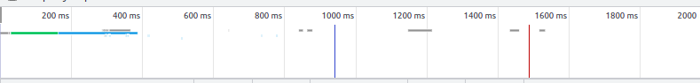
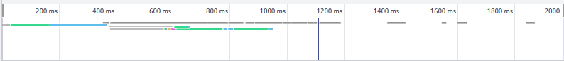

1.
shev@MyPC:~$ telnet stackoverflow.com 80 
Trying 151.101.1.69... 
Connected to stackoverflow.com. 
Escape character is '^]'. 
GET /questions HTTP/1.0 
HOST: stackoverflow.com 

HTTP/1.1 301 Moved Permanently 
cache-control: no-cache, no-store, must-revalidate 
location: https://stackoverflow.com/questions 
x-request-guid: bef9e2cb-d7b2-4f79-b827-dcd5e96ebffc 
feature-policy: microphone 'none'; speaker 'none' 
content-security-policy: upgrade-insecure-requests; frame-ancestors 'self' https://stackexchange.com 
Accept-Ranges: bytes 
Date: Thu, 02 Dec 2021 15:13:41 GMT 
Via: 1.1 varnish 
Connection: close 
X-Served-By: cache-hel1410031-HEL 
X-Cache: MISS 
X-Cache-Hits: 0 
X-Timer: S1638458021.013719,VS0,VE109 
Vary: Fastly-SSL 
X-DNS-Prefetch-Control: off 
Set-Cookie: prov=7e39bdfd-5bf6-b40d-1d78-a29fb3aecbe7; domain=.stackoverflow.com; expires=Fri, 01-Jan-2055 00:00:00 GMT; path=/; HttpOnly 

Connection closed by foreign host. 

Это заголовок страницы https://stackoverflow.com/questions 

2.
Request URL: http://stackoverflow.com/ 
Request Method: GET 
Status Code: 307 Internal Redirect 
Referrer Policy: strict-origin-when-cross-origin 
Location: https://stackoverflow.com/ 
Non-Authoritative-Reason: HSTS 
Accept: text/html,application/xhtml+xml,application/xml;q=0.9,image/avif,image/webp,image/apng,*/*;q=0.8,application/signed-exchange;v=b3;q=0.9 
Upgrade-Insecure-Requests: 1 
User-Agent: Mozilla/5.0 (X11; Linux x86_64) AppleWebKit/537.36 (KHTML, like Gecko) Chrome/96.0.4664.45 Safari/537.36 
  
Запрос https://stackoverflow.com/questions  обрабатывается дольше 
т.к. находится дальше и обьем информации на странице больше 
stackoverflow.com. 

stackoverflow.com/questions  

3.
5.18.158.197 

4.
Z-Telecom Network 
Автономная система AS41733 

5.
shev@MyPC:~$ traceroute -An 8.8.8.8 
traceroute to 8.8.8.8 (8.8.8.8), 30 hops max, 60 byte packets 
 1  192.168.31.1 [*]  3.994 ms  3.884 ms  3.836 ms 
 2  5.19.0.222 [AS41733]  217.204 ms  217.162 ms 5.19.0.218 [AS41733]  217.120 ms 
 3  5.19.2.246 [AS41733]  6.474 ms  6.433 ms  6.391 ms 
 4  188.234.131.158 [AS9049]  6.543 ms  6.345 ms  6.516 ms 
 5  188.234.131.159 [AS9049]  6.317 ms  6.303 ms 72.14.214.138 [AS15169]  6.289 ms 
 6  * * * 
 7  74.125.244.129 [AS15169]  4.898 ms  5.310 ms 216.239.59.142 [AS15169]  3.288 ms 
 8  74.125.244.132 [AS15169]  3.088 ms 74.125.244.133 [AS15169]  4.981 ms 74.125.244.180 [AS15169]  4.920 ms 
 9  72.14.232.85 [AS15169]  5.168 ms 216.239.48.163 [AS15169]  13.578 ms  13.912 ms 
10  216.239.40.61 [AS15169]  8.180 ms 172.253.79.115 [AS15169]  7.408 ms 216.239.48.163 [AS15169]  13.744 ms 
11  142.250.56.219 [AS15169]  8.392 ms * 172.253.79.237 [AS15169]  6.633 ms 
12  * * * 
13  * * * 
14  * * * 
15  * * * 
16  * * * 
17  * * * 
18  * * * 
19  * * * 
20  * 8.8.8.8 [AS15169]  7.561 ms * 
В скобках [] номера автономных систем 

6.
больший delay на AS41733 5.19.0.218 

7.
google.com.		157	IN	A	173.194.222.102 
google.com.		157	IN	A	173.194.222.138 
google.com.		157	IN	A	173.194.222.100 
google.com.		157	IN	A	173.194.222.113 
google.com.		157	IN	A	173.194.222.101 
google.com.		157	IN	A	173.194.222.139 

8.
8.8.8.8.in-addr.arpa.	300	IN	PTR	dns.google. 

