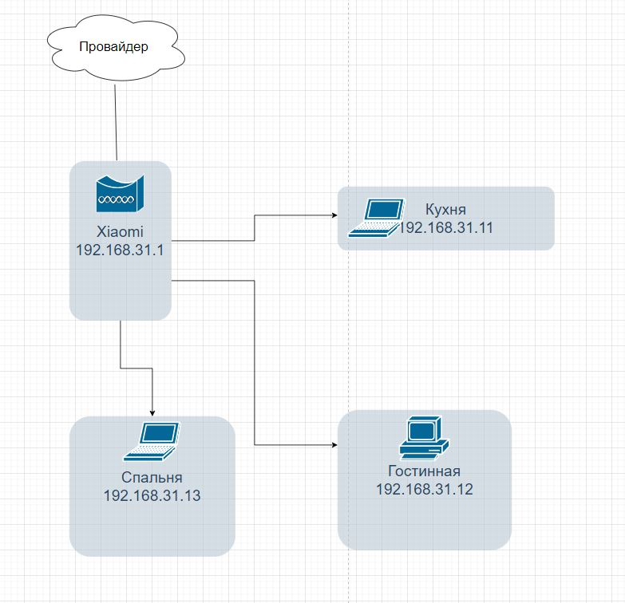

1.
<details>
  
```
route-views>sh ip route 5.19.0.222
Routing entry for 5.19.0.0/24
  Known via "bgp 6447", distance 20, metric 0
  Tag 6939, type external
  Last update from 64.71.137.241 7w0d ago
  Routing Descriptor Blocks:
  * 64.71.137.241, from 64.71.137.241, 7w0d ago
      Route metric is 0, traffic share count is 1
      AS Hops 3
      Route tag 6939
      MPLS label: none
```

```
route-views>sh ip bgp 5.19.0.222
BGP routing table entry for 5.19.0.0/24, version 45138263
Paths: (22 available, best #22, table default)
  Not advertised to any peer
  Refresh Epoch 1
  3549 3356 9002 9002 9002 9002 9002 9049 41733
    208.51.134.254 from 208.51.134.254 (67.16.168.191)
      Origin IGP, metric 0, localpref 100, valid, external
      Community: 3356:2 3356:22 3356:100 3356:123 3356:503 3356:903 3356:2067 3549:2581 3549:30840
      path 7FE0EF53E9C8 RPKI State not found
      rx pathid: 0, tx pathid: 0
  Refresh Epoch 1
  53767 174 174 1299 9049 41733
    162.251.163.2 from 162.251.163.2 (162.251.162.3)
      Origin incomplete, localpref 100, valid, external
      Community: 174:21000 174:22013 53767:5000
      path 7FE0F3F92BF0 RPKI State not found
      rx pathid: 0, tx pathid: 0
  Refresh Epoch 1
  3356 9002 9002 9002 9002 9002 9049 41733
    4.68.4.46 from 4.68.4.46 (4.69.184.201)
      Origin IGP, metric 0, localpref 100, valid, external
      Community: 3356:2 3356:22 3356:100 3356:123 3356:503 3356:903 3356:2067
      path 7FE02B2350C8 RPKI State not found
      rx pathid: 0, tx pathid: 0
  Refresh Epoch 1
  3333 9002 9049 41733
    193.0.0.56 from 193.0.0.56 (193.0.0.56)
      Origin IGP, localpref 100, valid, external
      path 7FE11A1914C0 RPKI State not found
      rx pathid: 0, tx pathid: 0
  Refresh Epoch 1
  57866 9002 9049 41733
    37.139.139.17 from 37.139.139.17 (37.139.139.17)
      Origin IGP, metric 0, localpref 100, valid, external
      Community: 9002:0 9002:64667
      path 7FE13DFC6428 RPKI State not found
      rx pathid: 0, tx pathid: 0
  Refresh Epoch 1
  20130 6939 9049 41733
    140.192.8.16 from 140.192.8.16 (140.192.8.16)
      Origin IGP, localpref 100, valid, external
      path 7FE146327AB0 RPKI State not found
      rx pathid: 0, tx pathid: 0
  Refresh Epoch 1
  101 174 1299 9049 41733
    209.124.176.223 from 209.124.176.223 (209.124.176.223)
      Origin incomplete, localpref 100, valid, external
      Community: 101:20100 101:20110 101:22100 174:21000 174:22013
      Extended Community: RT:101:22100
      path 7FE091528E88 RPKI State not found
      rx pathid: 0, tx pathid: 0
  Refresh Epoch 1
  852 1299 9049 41733
    154.11.12.212 from 154.11.12.212 (96.1.209.43)
      Origin IGP, metric 0, localpref 100, valid, external
      path 7FE11C918750 RPKI State not found
      rx pathid: 0, tx pathid: 0
  Refresh Epoch 1
  7660 2516 1299 9049 41733
    203.181.248.168 from 203.181.248.168 (203.181.248.168)
      Origin incomplete, localpref 100, valid, external
      Community: 2516:1030 7660:9003
      path 7FE098789418 RPKI State not found
      rx pathid: 0, tx pathid: 0
  Refresh Epoch 1
  2497 1299 9049 41733
    202.232.0.2 from 202.232.0.2 (58.138.96.254)
      Origin incomplete, localpref 100, valid, external
      path 7FE045898848 RPKI State not found
      rx pathid: 0, tx pathid: 0
  Refresh Epoch 1
  20912 3257 9002 9049 41733
    212.66.96.126 from 212.66.96.126 (212.66.96.126)
      Origin IGP, localpref 100, valid, external
      Community: 3257:8052 3257:50001 3257:54900 3257:54901 20912:65004 65535:65284
      path 7FE10E958B28 RPKI State not found
      rx pathid: 0, tx pathid: 0
  Refresh Epoch 3
  3303 9002 9049 41733
    217.192.89.50 from 217.192.89.50 (138.187.128.158)
      Origin IGP, localpref 100, valid, external
      Community: 3303:1004 3303:1006 3303:1030 3303:3055 9002:64667
      path 7FE0EA923EA8 RPKI State not found
      rx pathid: 0, tx pathid: 0
  Refresh Epoch 1
  4901 6079 9002 9002 9002 9002 9002 9049 41733
    162.250.137.254 from 162.250.137.254 (162.250.137.254)
      Origin IGP, localpref 100, valid, external
      Community: 65000:10100 65000:10300 65000:10400
      path 7FE11452A068 RPKI State not found
      rx pathid: 0, tx pathid: 0
  Refresh Epoch 1
  7018 1299 9049 41733
    12.0.1.63 from 12.0.1.63 (12.0.1.63)
      Origin incomplete, localpref 100, valid, external
      Community: 7018:5000 7018:37232
      path 7FE138B618F0 RPKI State not found
      rx pathid: 0, tx pathid: 0
  Refresh Epoch 1
  49788 1299 9049 41733
    91.218.184.60 from 91.218.184.60 (91.218.184.60)
      Origin incomplete, localpref 100, valid, external
      Community: 1299:30000
      Extended Community: 0x43:100:1
      path 7FE17CAF9448 RPKI State not found
      rx pathid: 0, tx pathid: 0
  Refresh Epoch 1
  8283 1299 9049 41733
    94.142.247.3 from 94.142.247.3 (94.142.247.3)
      Origin incomplete, metric 0, localpref 100, valid, external
      Community: 1299:30000 8283:1 8283:101
      unknown transitive attribute: flag 0xE0 type 0x20 length 0x18
        value 0000 205B 0000 0000 0000 0001 0000 205B
              0000 0005 0000 0001
      path 7FE100F8BB80 RPKI State not found
      rx pathid: 0, tx pathid: 0
  Refresh Epoch 1
  1221 4637 9002 9049 41733
    203.62.252.83 from 203.62.252.83 (203.62.252.83)
      Origin IGP, localpref 100, valid, external
      path 7FE02EB98568 RPKI State not found
      rx pathid: 0, tx pathid: 0
  Refresh Epoch 1
  701 1299 9049 41733
    137.39.3.55 from 137.39.3.55 (137.39.3.55)
      Origin incomplete, localpref 100, valid, external
      path 7FE16FE9BA20 RPKI State not found
      rx pathid: 0, tx pathid: 0
  Refresh Epoch 1
  3257 9002 9049 41733
    89.149.178.10 from 89.149.178.10 (213.200.83.26)
      Origin IGP, metric 10, localpref 100, valid, external
      Community: 3257:8052 3257:50001 3257:54900 3257:54901 65535:65284
      path 7FE0F59DCC50 RPKI State not found
      rx pathid: 0, tx pathid: 0
  Refresh Epoch 1
  3561 3910 3356 9002 9002 9002 9002 9002 9049 41733
    206.24.210.80 from 206.24.210.80 (206.24.210.80)
      Origin IGP, localpref 100, valid, external
      path 7FE15776D058 RPKI State not found
      rx pathid: 0, tx pathid: 0
  Refresh Epoch 1
  1351 6939 9049 41733
    132.198.255.253 from 132.198.255.253 (132.198.255.253)
      Origin IGP, localpref 100, valid, external
      path 7FE0FF9DE660 RPKI State not found
      rx pathid: 0, tx pathid: 0
  Refresh Epoch 1
  6939 9049 41733
    64.71.137.241 from 64.71.137.241 (216.218.252.164)
      Origin IGP, localpref 100, valid, external, best
      path 7FE16C9F8948 RPKI State not found
      rx pathid: 0, tx pathid: 0x0
```
</details>

2.

Интрефейс
```
9: dummy0: <BROADCAST,NOARP,UP,LOWER_UP> mtu 1500 qdisc noqueue state UNKNOWN group default qlen 1000
    link/ether 02:82:ee:11:70:b2 brd ff:ff:ff:ff:ff:ff
    inet 22.2.2.2/30 brd 22.2.2.3 scope global dummy0
       valid_lft forever preferred_lft forever
    inet6 fe80::82:eeff:fe11:70b2/64 scope link 
       valid_lft forever preferred_lft forever
```
Статические маршруты
```
 ip route show
default via 192.168.31.1 dev wlp4s0 proto dhcp metric 600 
10.50.40.111 via 10.126.0.1 dev tun0 proto static metric 450 linkdown 
10.50.40.133 via 10.126.0.1 dev tun0 proto static metric 450 linkdown 
10.62.48.244 via 10.126.0.1 dev tun0 proto static metric 450 linkdown 
10.62.48.245 via 10.126.0.1 dev tun0 proto static metric 450 linkdown 
10.126.0.0/16 dev tun0 proto kernel scope link src 10.126.80.4 metric 450 linkdown 
22.2.2.0/30 dev dummy0 proto kernel scope link src 22.2.2.2 
169.254.0.0/16 dev dummy0 scope link metric 1000 
172.17.0.0/16 dev docker0 proto kernel scope link src 172.17.0.1 linkdown 
192.168.31.0/24 dev wlp4s0 proto kernel scope link src 192.168.31.9 metric 600 

```

3.

```
vagrant@vagrant: sudo ss -tnlp
State  Recv-Q Send-Q   Local Address:Port   Peer Address:Port Process

LISTEN 0      4096           0.0.0.0:111         0.0.0.0:*     users:(("rpcbind",pid=697,fd=4),("systemd",pid=1,fd=35))

LISTEN 0      4096     127.0.0.53%lo:53          0.0.0.0:*     users:(("systemd-resolve",pid=698,fd=13))

LISTEN 0      128            0.0.0.0:22          0.0.0.0:*     users:(("sshd",pid=886,fd=3))

LISTEN 0      4096              [::]:111            [::]:*     users:(("rpcbind",pid=697,fd=6),("systemd",pid=1,fd=37))

LISTEN 0      128               [::]:22             [::]:*     users:(("sshd",pid=886,fd=4))
```

По TCP На 22 порту процесс sshd, на 53 локальный резолвер DNS, на 111 служба удалённого запука процедур RPC.

4.

```
vagrant@vagrant: sudo ss -unlp
State  Recv-Q Send-Q   Local Address:Port   Peer Address:Port Process

UNCONN 0      0        127.0.0.53%lo:53          0.0.0.0:*     users:(("systemd-resolve",pid=698,fd=12))

UNCONN 0      0       10.0.2.15%eth0:68          0.0.0.0:*     users:(("systemd-network",pid=445,fd=20))

UNCONN 0      0              0.0.0.0:111         0.0.0.0:*     users:(("rpcbind",pid=697,fd=5),("systemd",pid=1,fd=36))

UNCONN 0      0                 [::]:111            [::]:*     users:(("rpcbind",pid=697,fd=7),("systemd",pid=1,fd=38))
```

53 - локальный резолвер DNS, 68 - systemd-network, 111 - RPC

5.

